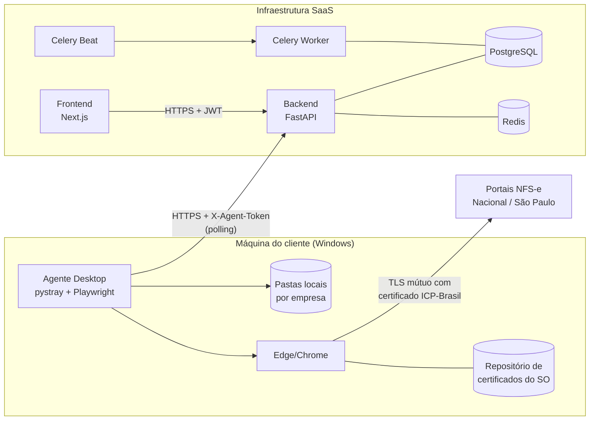
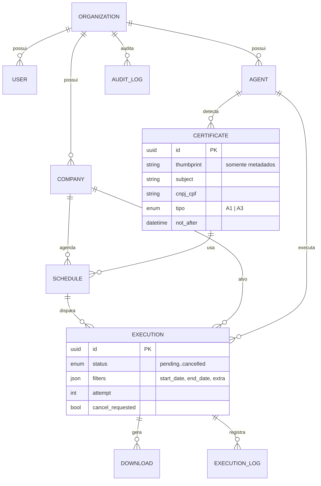
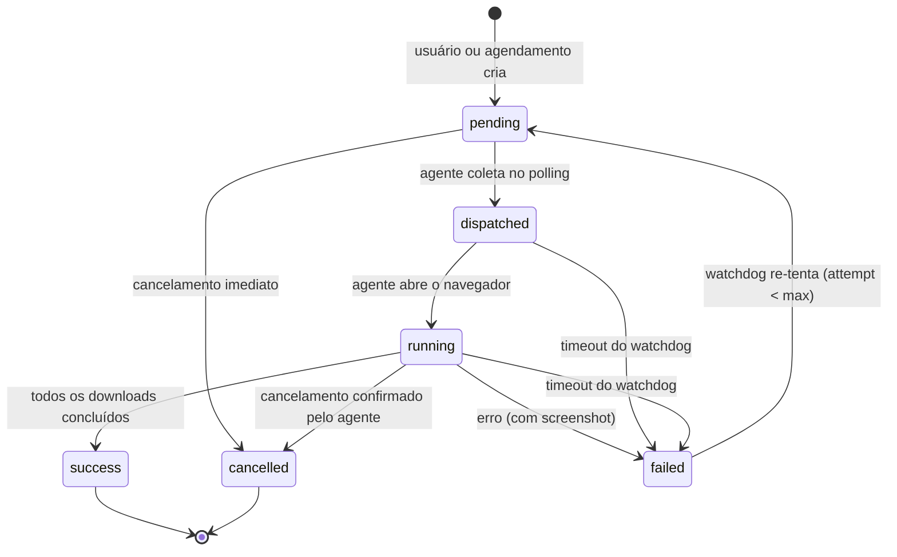

# Arquitetura

## Visão geral



## Decisões-chave

| Decisão | Justificativa |
|---|---|
| Execução no agente (não no servidor) | A chave privada do certificado (A1/A3) nunca sai da máquina do cliente; A3 é fisicamente impossível de mover. |
| Polling do agente (pull) | Funciona atrás de NAT/firewall corporativo sem abrir portas; intervalo de 10 s dá latência aceitável. |
| Arquivos permanecem locais | Requisito do produto: backend guarda apenas metadados (nome, hash, tamanho, caminho). |
| Adaptadores de portal | Cada portal muda com frequência; o contrato `PortalAdapter` isola o acoplamento e permite trocar scraping por API oficial. |
| Celery beat p/ agendamentos | Expressões cron por agendamento no banco; o beat só varre `next_run_at <= now`, escalando para milhares de agendamentos. |

## Modelo de dados



## Ciclo de vida de uma execução



## Camadas do backend

```
app/
├── api/v1/        # Rotas HTTP (controllers) — validação e autorização
├── schemas/       # Contratos Pydantic (entrada/saída)
├── services/      # Regras de negócio reutilizáveis (auditoria, cron, matrícula)
├── models/        # Entidades SQLAlchemy (persistência)
├── workers/       # Tarefas Celery (agendador, watchdog, limpeza)
└── core/          # Config, segurança, banco, rate limit, dependências
```

Dependências apontam para dentro (API → services → models), seguindo
Clean Architecture pragmática. Tipagem forte em todas as camadas
(SQLAlchemy 2 `Mapped[]`, Pydantic v2, TypeScript `strict`).
