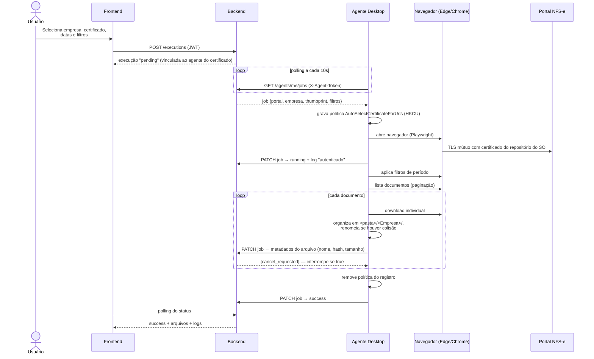
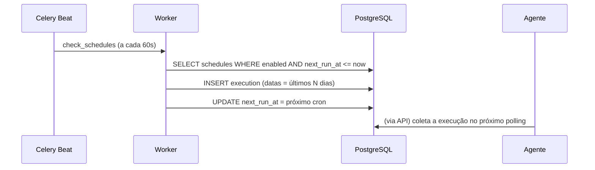

# Fluxos

## Fluxo principal: execução manual

## Fluxo de falha

1. Exceção durante a automação → agente captura **screenshot da página**.
2. Screenshot (base64) + stack trace são enviados no `PATCH` do job.
3. Backend grava `ExecutionLog(level=error, screenshot_path=...)` e marca `failed`.
4. O **watchdog** (Celery, a cada 60 s) re-enfileira se `attempt < max_attempts`.
5. Execuções sem progresso por `EXECUTION_TIMEOUT_MINUTES` são expiradas.

## Fluxo de agendamento

Presets no dashboard: **todos os dias às 08:00** (`0 8 * * *`), **toda
segunda-feira** (`0 8 * * 1`), **todo dia 1º do mês** (`0 6 1 * *`) e cron
personalizado. Execução manual é o fluxo principal acima.

> Como o certificado só existe na máquina do cliente, agendamentos exigem o
> agente **online** no horário; jobs criados com o agente offline ficam na
> fila e são coletados assim que ele volta.

## Fluxo de matrícula do agente

1. Admin clica em **Gerar token de matrícula** (validade 15 min, uso único).
2. Na máquina do cliente: `sistema-agent --enroll <TOKEN> --api <URL>`.
3. Backend valida o token, cria o `Agent` e devolve um **token permanente**
   (guardado com hash SHA-256; exibido uma única vez).
4. O agente passa a enviar heartbeat (30 s) e a sincronizar os metadados dos
   certificados visíveis (5 min).
